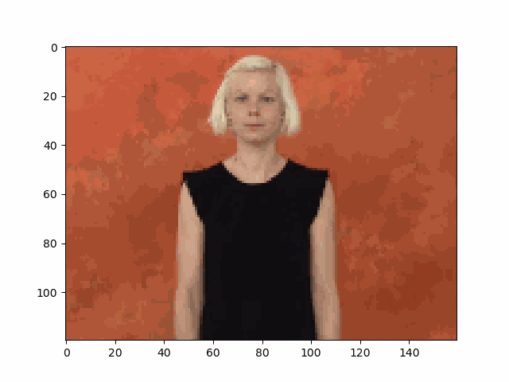
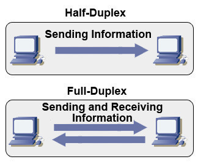
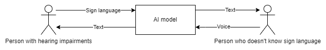

# sign_language_gesture_recognition

## How to navigate the project
-------------------------------

[Jupiter notebook file containing whole learning process](./asl_gesture_recognition.ipynb)

[Mediapipe Holistic landmark dataset for 17 most sampled words](./keys_train)

[Resized and subsampled to 30 frames dataset of images for 17 most sampled words](./img_train)

[Mediapipe Holistic landmark dataset for 95 most basic words](./keys_dataset)

[Resized and subsampled to 10 frames dataset of images for 95 most basic words](./selected_dataset)

Saved models:
- [Original](./best_model.h5)
- [After regularization - I](./best_reg_model.h5)
- [After regularization - II](./best_reg_model_2.h5)

## License

This project is licensed under the Apache License 2.0
You can read more about it [here](./LICENSE)

## Introduction

> “You know, no amount of smiling at a flight of stairs has ever made it turn into a ramp. Never. Smiling at a television screen isn’t going to make closed captions appear for people who are deaf. No amount of standing in the middle of a bookshop and radiating a positive attitude is going to turn all those books into Braille,” ~ [Stella Young](https://epicassist.org/the-biggest-barrier-for-people-with-disability/).

ASL sign in ASL:

Current world is far from perfect and just and many people are forced play it on a **hard mode**, not because of their physique, diversity, disabilities which they are having, but because of the barriers which society doesn't break down to make it more inclusing and accessible for all. Barriers which **can** be destroyed with the current technology.

One of such example is communication barrier for people with hearing impairments when doing errands, visiting offices, etc. when there is noone who knows Sign Language ([Source](https://www.cdc.gov/ncbddd/disabilityandhealth/disability-barriers.html)) . Of course it is always possible for them to write their massages but this style of communication is slower (can be compared to *half duplex* when there is only one side which can send information at the same time) than oral communication (*full duplex*, more nuanced, allowing speakers to exchange information live, simultanously).

Inspired by Microsoft Inlusive Design we propose a simple solution which could allow for people with hearing problem to communicate more freely with people who don’t know Sign Language.

- [Microsoft - Inclusive design](https://www.microsoft.com/design/inclusive/)
- [Microsoft - Gaming for everyone](https://news.microsoft.com/gamingforeveryone/)

Communication model:

Recognizing gestures from American Sign Language (Sign Language -> Text) as well as speech recognition (Speech -> text) 

Because there are already [libraries](https://pypi.org/project/SpeechRecognition/) and solutions which deal with speech recognition we will foremost focus on the first part of the communication.

## Dataset

[WLASL (World Level American Sign Language) Video](https://www.kaggle.com/datasets/risangbaskoro/wlasl-processed)
- largest opensource video dataset found by author
- 12 000 processed videos
- 2000 most common words
- "*Most existing sign language datasets are limited to a small number of words. Due to the limited vocabulary size, models learned from those datasets cannot be applied in practice. In this paper, we introduce a new large-scale Word-Level American Sign Language (WLASL) video dataset, containing more than 2000 words performed by over 100 signers.*" ~ [WLASL Scientfic Paper](https://arxiv.org/abs/1910.11006)
- "*66% at top-10 accuracy on 2,000 words/glosses*"  ~ [WLASL Scientfic Paper](https://arxiv.org/abs/1910.11006)
- Very difficult task, relatively new (from 2019)
- Current State-of-the-Art model achieves 58% TOP-1 accuracy 

## Current progress

- [x] Feature extraction using [MediaPipe Holistic](https://google.github.io/mediapipe/solutions/holistic.html) based on [source](https://www.youtube.com/watch?v=doDUihpj6ro)
- [x] Dataset preprocessing
    - [x] Image resize
    - [x] Subsample video to constant number of frames
- [x] Create dataset of 17 most sampled words from original dataset
- [x] Write Python generator to load dataset in batches
- [x] Train LSTM model on 17 most sampled words with promising accuracy
- [ ] Train CNN model on 17 most sampled words (no GPU power to do so)
- [x] Create dataset of 95 most basic words from original dataset
- [ ] Train LSTM model on 95 most basic words (currently model doesn't have enough samples to learn so many labels)
- [x] Create dataset of 19 letters from original dataset
- [ ] Train LSTM model on 19 letters (currently model doesn't have enough samples to learn so many labels)
- [x] Save best models using Keras Callbacks
- [ ] Gather additional datasets / Generate new dataset

## Example

## Credits
Project was **heavily** inspired by **Nicholas Renotte** video on youtube [Sign Language Detection using ACTION RECOGNITION with Python | LSTM Deep Learning Model](https://www.youtube.com/watch?v=doDUihpj6ro), here you can find his code [Github website](https://github.com/nicknochnack/ActionDetectionforSignLanguage).

Preprocessing as well as model training differs as Nicholas was working on videos which he captured, while author used WLASL dataset.

